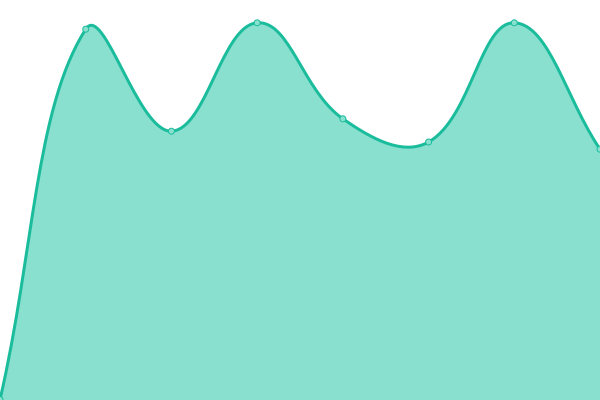

# [📈 Live Status](https://status.mikorm.app): <!--live status--> **🟩 All systems operational**

This repository contains the open-source uptime monitor and status page for [Dominic](https://dominic-ktz.de), powered by [Upptime](https://github.com/upptime/upptime).

With [Upptime](https://upptime.js.org), you can get your own unlimited and free uptime monitor and status page, powered entirely by a GitHub repository. We use [Issues](https://github.com/Dominic-ktz/mikorm-upptime/issues) as incident reports, [Actions](https://github.com/Dominic-ktz/mikorm-upptime/actions) as uptime monitors, and [Pages](https://status.mikorm.app) for the status page.

<!--start: status pages-->
<!-- This summary is generated by Upptime (https://github.com/upptime/upptime) -->
<!-- Do not edit this manually, your changes will be overwritten -->
<!-- prettier-ignore -->
| URL | Status | History | Response Time | Uptime |
| --- | ------ | ------- | ------------- | ------ |
|  [Mikorm Website](https://mikorm.app) | 🟩 Up | [mikorm-website.yml](https://github.com/Dominic-ktz/mikorm-upptime/commits/HEAD/history/mikorm-website.yml) | 

 1338ms
     
 | 

<a href="https://status.mikorm.app/history/mikorm-website">100.00%</a>
    

|  [Mikorm API](https://mikormconnect.mikorm.app) | 🟩 Up | [mikorm-api.yml](https://github.com/Dominic-ktz/mikorm-upptime/commits/HEAD/history/mikorm-api.yml) | 

 481ms
     
 | 

<a href="https://status.mikorm.app/history/mikorm-api">100.00%</a>
    

|  [Opendata (CDN)](https://opendata.mikorm.app/) | 🟩 Up | [opendata-cdn.yml](https://github.com/Dominic-ktz/mikorm-upptime/commits/HEAD/history/opendata-cdn.yml) | 

 479ms
     
 | 

<a href="https://status.mikorm.app/history/opendata-cdn">100.00%</a>
    

<!--end: status pages-->

[**Visit our status website →**](https://status.mikorm.app)

## 📄 License

- Powered by: [Upptime](https://github.com/upptime/upptime)
- Code: [MIT](./LICENSE) © [Anand Chowdhary](https://anandchowdhary.com), supported by [Pabio](https://pabio.com)
- Data in the `./history` directory: [Open Database License](https://opendatacommons.org/licenses/odbl/1-0/)
